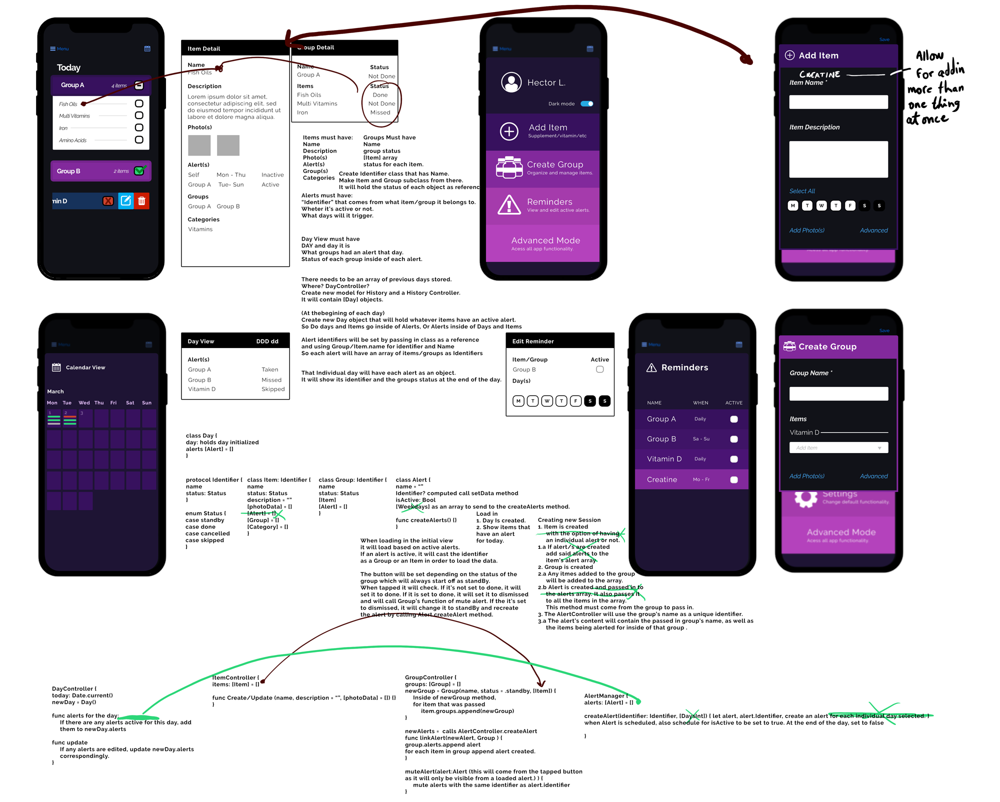

# SUPPort - The supplement tracker
> *Get it, **SUPP**ort, because it supp**ort**s you with **supp**lements?*

At the time this project was completed, I had finished my first **3 weeks** of iOS Development experience at Lambda School.

Subjects covered, and therefore my entire Swift/XCode arsenal (*at the time*) is composed of mostly :

 - The overall basics of Swift as a programming language. (*Conditions, loops, OOP, etc.*).
 - XCode's UI Builder tools.
 - Creating custom table views.
 - Basic persistence methods (*Saving data onto a .plist file.*).
 - Basic usage of Alerts, timers, tabbed navigation
 - Among other several other basic concepts.

# The App :iphone:
The heart of the application is in its simplicity in functionality for the user. The user can create entries for items, which can then be grouped together. Each group can be linked to an alert. This would remind the user periodically of the medications within this group.

The full extent of functionality within the app is as follows:

### Items :pill:- [***C R U D***]
- Full CRUD functionality.
- **Name :** field.
- **Description :** field.

### Groups :open_file_folder:- [***C R U D***]
- Full CRUD functionality.
- **Name :** field.
- **Items :** field.
- **Alert :** option.

### Alert :heavy_exclamation_mark: - [***C R U D***]
- CRUD functionality is linked to the groups. 
- Groups can be marked as ***taken***, which would mute its alert for the day.
- Alerts can be created on group creation, or through the view all groups menu.
- All groups containing active alerts can be viewed under the view active alerts menu.

# The project - :chart:
That's about it as far as the final product goes. As can be seen in the final commits, I worked on the app 3 more days after that week in order to finish implementing the last couple touches of functionality.

I would've loved to add a lot more functionality to the project in order to make it a *"flashier"* portfolio piece. Unfortunately, all the lessons and growth I gained from this project came from my many mistakes, which I talk about in the following write-up.

## :key: Key Lesson #1 - What really matters

> Mistake

As my first time working on a full application entirely on my own, my first and biggest mistake came from my  :

I fell into the trap of devoting countless hours to designing overall UI Layouts, small UI elements and planning for extended functionality right off the bat.

This cost me the better part of my week. Leaving me with nothing but a couple of afternoons to work on my project. *Maybe some brownie points for getting so much done in only a couple of days?* :eyes:

> Lesson

By the final stages of "design" I realized I could make do with a much much more simplified approach. Moving forward, as someone who is very visual I will continue to devote time to certain levels of visualization of the app, but now I know that **nothing more than where each piece of functionality will be placed, and how it connects with one another** really matter.

## :key: Key Lesson #2 - CRUD & Data Permanence
> Mistake

Given how easy it was to implement data permanence through .plists in previous projects, as well as how "simple" the concept of CRUD sounds, I lead myself towards a pitfall of not prioritizing these aspects of the design.
> Lesson

Due to the reasons in the next Key Lesson, I now believe that if CRUD Functionality, and Data Permanence is to be implemented, it should be of the highest priority. Not only is creating the connection between all aspects of your data across your entire application much more challenging than it seems at first. There is no way to know if your "Data Structure" functions as you'd hope until it's tested with these aspects of your app.

## :key: Key Lesson #3 - Data Structures
> Mistake

This is the part I feel where I grew the most, even though my mistake was simply *not knowing enough*. I aimed to achieve linking across all my data through the use of Protocols, and creating nested properties passed in by reference.

- Using Protocols in this way caused issues with the Codable Swift protocols to the point where I had to drop the entire idea. 
- Passing objects to one another by reference caused infinite loops that led the app to self destruct.
> Lesson

As I study computer science on my own free time, I learned about the basic of Data Structures, and how SQL handles relationships through the use of unique IDs. As I've learned about this and UUIDs, I now can approach Data Structures in a much more efficient way.

Given how the entirety of the app relies on the data structure, I now believe you must learn if your model holds up ***as soon as possible***.
